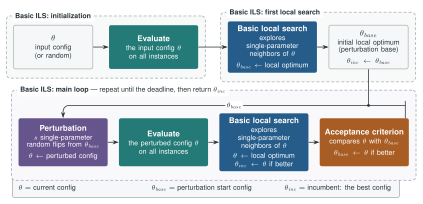

# 🐏 RamParILS

A parallel Rust rewrite of [ParamILS](https://www.cs.ubc.ca/labs/algorithms/Projects/ParamILS/) —
automated algorithm configuration via Iterated Local Search.

Used as the inner tuner in [Grackle](https://github.com/ai4reason/grackle), a strategy portfolio
invention system for automated reasoning solvers.

## 💡 What it does

Given a target algorithm with configurable parameters, RamParILS searches for the parameter
setting that minimises runtime or a numeric solution cost on a set of training instances.
It uses **FocusedILS** by default. RamParILS starts by scoring configurations on a configurable
prefix of the training instances and increases that shared fidelity when the incumbent survives a
challenge. Neighbours are submitted to a bounded worker pool, and the first fully evaluated
improvement is accepted. Results can be stored in a **persistent SQLite cache** for reuse by
compatible tuning runs.

Cache entries are keyed only by the active configuration and instance path. Use a separate
cache when the algorithm command, cutoff, objective, solver version, wrapper behavior, or random
seed changes. Reusing a cache across incompatible scenarios can silently return stale results.

## 🚀 Key differences from Ruby ParamILS

| | Ruby ParamILS | RamParILS |
|---|---|---|
| Evaluation | Sequential | **Parallel** over all `(neighbour, instance)` pairs |
| Cache | In-memory, per-run | **Persistent SQLite**, shared across runs, self-describing |
| Cache inspection | — | `ramparils db solved \| status \| confs` |
| Python API | subprocess call | **Native extension** via PyO3 |
| Search modes | BasicILS, FocusedILS | BasicILS, FocusedILS, `random` (ParamILS's `pert_rand`) |
| Escaping a local optimum | Random restart at fixed probability (`p_restart`), `R` random probes | Both, **plus soft acceptance within a tolerance and stagnation-triggered restarts** |
| Restart target | Uniformly random configuration | Random, **or a bounded perturbation of the incumbent** |
| Comparing across fidelities | Score vector per configuration, compared at a common level | **Single score, re-measured** for the incumbent and the home base at every fidelity increase |
| Multi-phase schedules | — | **Iterative deepening**: geometric growth of instances, cutoff and deadline |
| Provenance | — | Source revision in `--version` and every log header; full scenario echoed at startup |
| Non-deterministic algorithms (multiple seeds) | Supported | Not (yet) supported |

Parallel evaluation is the primary motivation for the rewrite. Actual speedup depends on worker
count, neighbourhood width, current fidelity, solver runtimes, early acceptance, and cache hits.
The persistent cache compounds this advantage across compatible Grackle tuning runs on overlapping
problem sets.

  

The search in its `basic` form: θ is the current candidate, θ_base the point each perturbation
starts from, and θ_inc the incumbent that the run returns. See [Algorithm](reference/algorithm.md)
for what each box does and for the FocusedILS fidelity schedule.

## 🔗 Quick links

- [Installation](installation.md)
- [CLI usage](usage/cli.md)
- [Python API](usage/python.md)
- [Algorithm](reference/algorithm.md)
- [Parameter file format](reference/params.md)
- [Solver wrapper protocol](reference/protocol.md)

## 🤝 Acknowledgements

This project is part of [DEEPER](https://deeper4ai.github.io/) and supported by the [DEEPER grant](https://www.renaissancephilanthropy.org/deeper-exploratory-engine-for-precise-expert-reasoning) from Renaissance Philanthropy.
